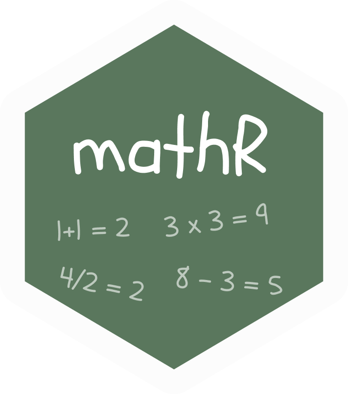

# mathR
basic math functions

```
remotes::install_github('PythonCoderUnicorn/mathR')

# or 

devtools::install_github("PythonCoderUnicorn/mathR")
```

load the library
```
library(mathR)
```

Add example
```
add(4,8)

# or 
x = 1:5
y = 11:16
add(x, y)
```
